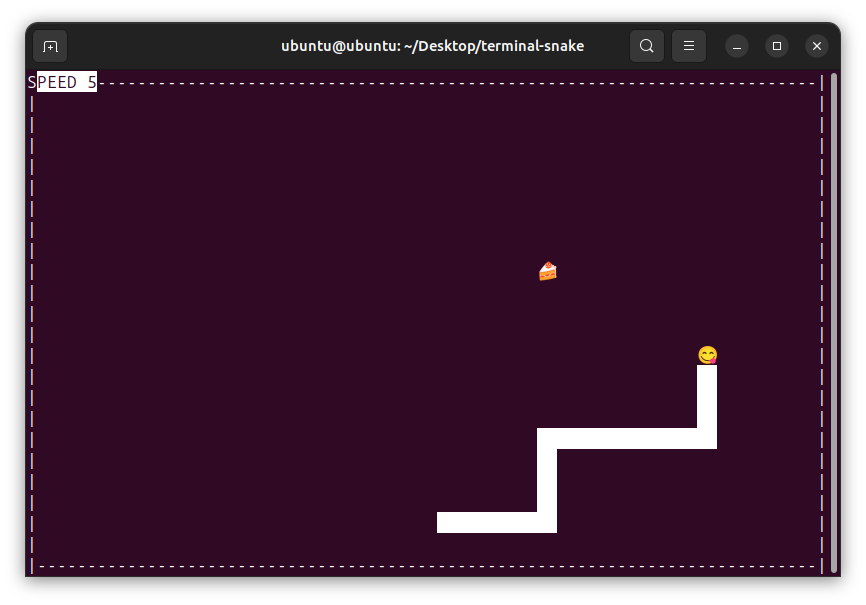

# Build instructions for Windows 10
- Make sure you have `MinGW-w64` on your system.
- Make sure also have `ncursesw` libraries and `pkg-config` installed.
- Make sure your `PATH` environment variable is set correctly. (to use `gcc` and other tools)

### You can refer [here](https://code.visualstudio.com/docs/cpp/config-mingw#_installing-the-mingww64-toolchain) to install and configure `MinGW-w64` via `MSYS2`.
(Ignore the vscode related stuff.)

##

#### The following commands are for `PowerShell`. (`Windows PowerShell` should be fine.)
- `git clone https://github.com/D-Chandrahas/terminal-snake.git` **or** download the repository as a zip file and extract it.
- `cd terminal-snake/`
- `gcc -w -O3 ./src/*.c -o ./bin/snake.exe -I./include (pkg-config ncursesw --cflags --libs).split()`

### The compiled executable can be found in `terminal-snake/bin/` directory.
- Only tested on windows terminal.
- You may need to enable UTF-8 support. Settings->Time & Language->Language->Administrative language settings->Change system locale->Tick the checkbox.

# Build instructions for Ubuntu 23.10
- `sudo apt update`
- `sudo apt install libncursesw6 pkg-config`
- `git clone https://github.com/D-Chandrahas/terminal-snake.git`
- `cd terminal-snake/`
- `gcc -w -O3 ./src/*.c -o ./bin/snake -I./include $(pkg-config ncursesw --cflags --libs)`

### Usage
    ./bin/snake

# How to play
- Use `arrow keys` or `W`/`A`/`S`/`D` to turn the snake in the respective direction.
- Increase score by leading the snake to the food.
    - The score is displayed at the top left corner.
- The game ends when the snake collides with a wall or itself.
- During the game, the snake's speed can be decreased/increased by pressing `[` or `]` respectively.
    - The speed is displayed at the top left corner when it's being adjusted.
    - The game pauses when you are adjusting the speed.
        - Press `enter` to confirm the new speed and resume the game.

# Screenshots

# Further details
- The emoji used for the snake's head changes based on its state.
    - Normally it is 👀.
    - When the snake is within certain distance of 🍰, it changes to 👄.
    - If the snake has just eaten 🍰, it changes to 😋 for a few ticks.
    - If the snake collides with a wall or itself, it changes to ☠️.
